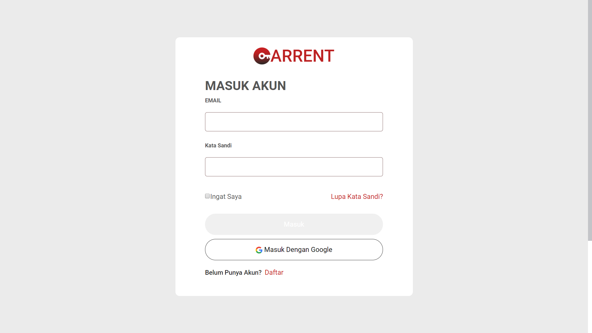
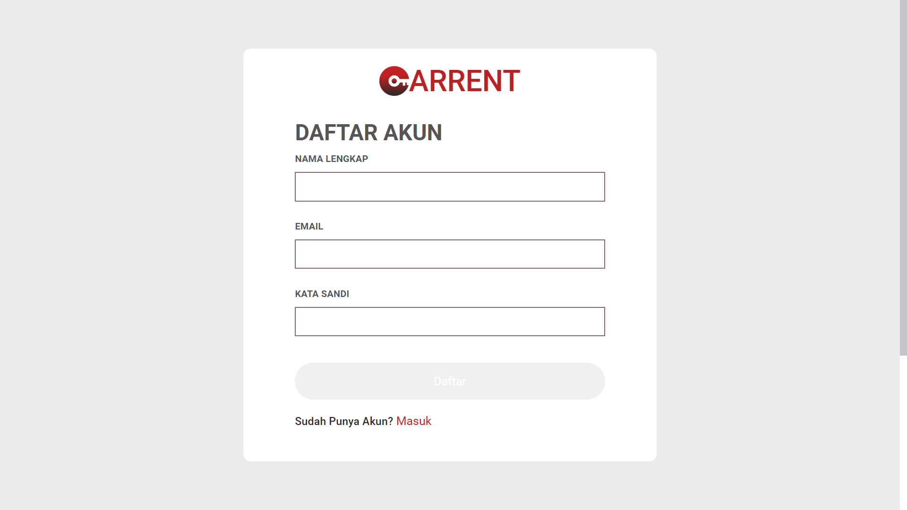
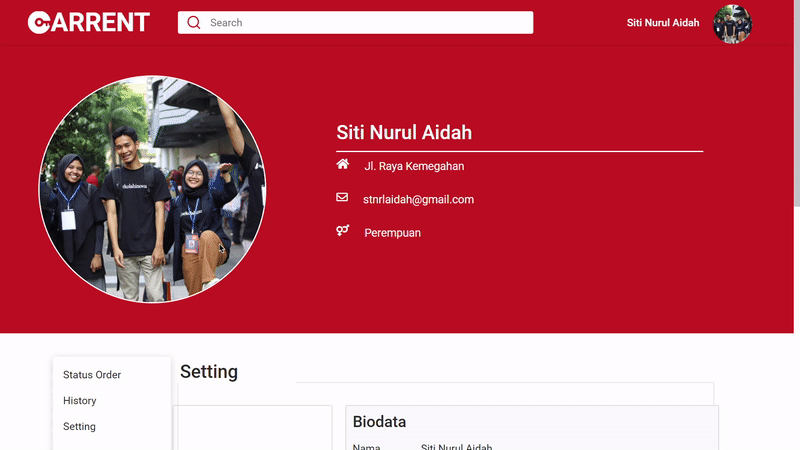

# Carrent


<p align="center">
  &nbsp;
  
</p>
<p align="center">
  Built with Vue Js.
</p>

## Table of Contents

- [Features](#features)
- [Requirements](#requirements)
- [Usage](#usage-for-development)
- [Create Environment Variable](#create-environment-variable)
- [Screenshots](#screenshots)
- [Related Project](#related-project-backend)
- [Contributors](#contributors)

## Features

- Users who are not logged in can only view the product
- Users must sign up and sign in to make a transaction and see their profiles
- And others

## Requirements

- Node.js - Download and Install [Node.js](https://nodejs.org/en/).
- Vue.js - Download and Install [Vue.js](https://vuejs.org/v2/guide/)

## Usage for development

1. Open your terminal or command prompt
2. Type `git clone https://github.com/HiRahmat-Dev/carrent-vuejs.git`
3. Open the folder and type `npm install` for install dependencies
4. Create Environment Variable [here](#create-environment-variable)
5. Before run this, you must run backend first, [check here](#related-project-backend)
6. Type `npm run serve` for run this app.

## Create Environment Variable

```
$ touch .env.local
$ nano .env.local
```

```
# Set API KEY
VUE_APP_API=YOUR_HOST_URL
VUE_APP_SECRET_KEY_TOKEN=YOUR_SECRET_KEY
```

## Screenshots

<div align="center">
    
</div>
<div align="center">
       
    
</div>
<div align="center">
       
    
</div>

## Related Project (Backend)

* [`Backend-Carrent`](https://github.com/HiRahmat-Dev/carrent-api)

## Contributors
<center>
  <table>
    <tr>
      <td align="center">
        <a href="https://github.com/HiRahmat-Dev/">
          <br/>
          <b>Rahmat Hidayatullah</b>
        </a>
      </td>
      <td align="center">
        <a href="https://github.com/akbarism">
          <br/>
          <b>Akbar Ismail</b>
        </a>
      </td>
      <td align="center">
        <a href="https://github.com/azmprllynsa">
          <br/>
          <b>azmprllynsa</b>
        </a>
      </td>
      <td align="center">
        <a href="https://github.com/m-joseph27">
          <br/>
          <b>Muhammad Yusuf</b>
        </a>
      </td>
      <td align="center">
        <a href="https://github.com/haras94">
          <br/>
          <b>Harun</b>
        </a>
      </td>
    </tr>
  </table>
</center>
